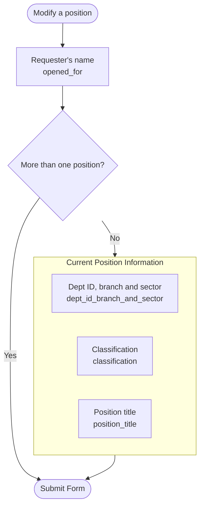

```mermaid
flowchart TD

    %% --------------------------------------------------
    %% PART 1: DEFINE VARIABLES & SECTIONS
    %% --------------------------------------------------
    Start([Modify a position])
    requester_name["Requester's name <br> opened_for"]
    is_multi_position{"More than one position?"}

    %% This creates your section / namespace box
    subgraph position_info_section [Current Position Information]
        %% Just list the variables belonging to this section inside here
        dept_id["Dept ID, branch and sector <br> dept_id_branch_and_sector"]
        classification["Classification <br> classification"]
        position_title["Position title <br> position_title"]
    end

    Submit([Submit Form])

    %% --------------------------------------------------
    %% PART 2: CONNECT THE RELATIONSHIPS
    %% --------------------------------------------------
    Start --> requester_name
    requester_name --> is_multi_position
    
    %% Pointing to the section connects to the first item inside it
    is_multi_position -- No --> position_info_section
    is_multi_position -- Yes --> Submit
    
    position_info_section --> Submit
```
